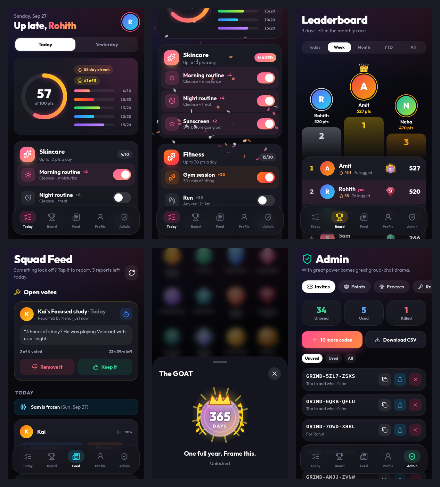

# Grind Squad

An invite-only daily habit competition for a friend group. Log skincare, fitness, nutrition, study and sleep every day, lose points for slip-ups, and fight for the monthly crown (and avoid the last-place award).

**Stack:** Next.js (on Vercel) + Supabase (Postgres database + login). Free tiers of both are enough for this.



> This repo contains no keys or invite codes. Each deployment creates its own random invite codes in its own database, and all secrets live in Vercel environment variables.

---

## What's inside

| Screen | What it does |
|---|---|
| **Today** | Toggles, steppers and chips to log today or yesterday. Live score ring, per-category progress, streak, today's rank. Confetti when a category is maxed. Freeze request button. |
| **Board** | Rankings by net points for Today / Week / Month / YTD / All time. Podium, streak flames, best badge. Hall of Fame with monthly + yearly awards. |
| **Feed** | Everyone's entries from the last 3 days. Tap any entry to report it (3 reports per person per day). Open votes with Remove / Keep buttons. Recent verdicts. |
| **Profile** | Photo, name, bio, stats, 16 streak badges, trophy case, change password. Tap a friend anywhere to see theirs. |
| **Admin** (only you) | Invite codes (share, copy, kill, generate, CSV), add/remove points with a reason, approve freezes, override reports, reset passwords, remove members, edit scoring rules. |

### The rules (all enforced in the database, not just the UI)

- **Logging:** only today and yesterday, only for yourself.
- **Daily caps:** Skincare 10, Fitness 30, Nutrition 20, Study 20, Sleep 20 → max 100/day. Slip-ups max −40/day.
- **Slip-ups** (junk food, alcohol, smoking, weed) are visible only to the person and the admin. Others only see the effect on the net score.
- **Freezes:** a user requests a day or a range (trip); the admin approves. A frozen day scores 0, can't be logged, and doesn't break the streak.
- **Reports:** max 3 per person per day. The reporter's report counts as a "remove" vote. Everyone except the reported person votes, anonymously, within 24h. At least half must vote, or the entry stays. More remove → entry voided. More keep → stays. Tie → one revote. Tie again → admin decides.
- **Streak day:** any day with positive points from logged habits (not frozen). Not having logged *today yet* doesn't break it.
- **Awards:** when a month ends, the top scorer gets a champion title and the lowest gets a roast title (e.g. "Stuffed Turkey" in November). Yearly titles on Jan 1. You must have joined in the first week of the month to be eligible. People with 7+ frozen days that month can't get last place. Last place needs at least 3 eligible people.
- **Admin adjustments** are separate entries with a reason, shown in the feed, never silent edits.

---

## Setup (about 20 minutes)

### 1. Create the Supabase project
1. Go to [supabase.com](https://supabase.com) → **New project**. Pick a region close to you (e.g. East US). Save the database password somewhere.
2. When it's ready, open **SQL Editor → New query**, paste the whole of [`supabase/schema.sql`](supabase/schema.sql), and click **Run**. It should say "Success".
3. Open **Authentication → Sign In / Providers** (called "Providers" or "Auth settings" in some versions):
   - Keep **Email** enabled (it's used behind the scenes for username + password).
   - Turn **off** "Allow new users to sign up". Accounts are created only through the app's invite-code check. (The database also blocks sign-ups without a valid code, so this is a second lock.)
4. Open **Project Settings → API Keys** (or **API**) and copy three things:
   - Project URL (`https://xxxx.supabase.co`)
   - The **anon / publishable** key
   - The **service_role / secret** key. Keep this one private: it only goes into Vercel, never into code or chat.

### 2. Put the code on GitHub
```bash
cd grind-squad
git init        # skip if it's already a repo
git add -A && git commit -m "Grind Squad"
# create an empty PRIVATE repo on github.com, then:
git remote add origin https://github.com/<you>/grind-squad.git
git push -u origin main
```

### 3. Deploy on Vercel
1. [vercel.com](https://vercel.com) → **Add New → Project** → import the repo.
2. Under **Environment Variables**, add:

   | Name | Value |
   |---|---|
   | `NEXT_PUBLIC_SUPABASE_URL` | your Project URL |
   | `NEXT_PUBLIC_SUPABASE_ANON_KEY` | anon / publishable key |
   | `SUPABASE_SERVICE_ROLE_KEY` | service_role / secret key |

3. Click **Deploy**. You get a link like `grind-squad.vercel.app`. You can rename it under **Settings → Domains**.

### 4. Make yourself admin
The **first account created becomes admin automatically**, so sign up before you share anything:
1. In Supabase **SQL Editor**, run: `select code from invite_codes limit 1;`
2. Open your Vercel link → **Join the squad** → use that code, pick your username and password.
3. You'll see the **Admin** tab. (If something went wrong, run `update profiles set is_admin = true where username = 'yourname';`)

### 5. Invite friends
Admin → **Invites** → tap the share icon on a code. On iPhone this opens the share sheet with a message like:
> You're invited to Grind Squad. Sign up here: https://…/signup?code=GRIND-AB12-CD34

The link fills in the code for them. Tap a code to note who it's for. **Download CSV** gives you your own copy of every code. The ✕ button kills an unused code.

### 6. Install on iPhone
Open the link in **Safari** → **Share** → **Add to Home Screen**. It opens full-screen like a normal app. (The app shows this hint automatically in Safari.)

---

## Everyday admin tasks

- **Forgot password:** Admin → Members → Reset password. Send them the temporary one; they can change it in Profile.
- **Someone cheated:** Admin → Points → pick them, pick −10/−20/etc., write the reason (everyone sees it in the feed).
- **Freeze requests:** Admin → Freezes → Approve / Deny, or freeze someone directly.
- **Change scoring:** Admin → Rules. Changes apply to new entries; past points stay as logged.
- **Timezone:** "today" follows `America/Chicago`. To change it, run in SQL Editor:
  `update app_settings set timezone = 'America/New_York';`
- **Report limit / voting window:** `update app_settings set reports_per_day = 3, vote_hours = 24;`

## Developing locally
```bash
npm install
cp .env.example .env.local   # fill in your Supabase values
npm run dev                  # http://localhost:3000
npm run test:db              # runs the database rule tests (no Supabase needed)
```

## Notes and limits
- Usernames are turned into a hidden email (`name@users.grindsquad.app`) because Supabase login needs one. No emails are ever sent. Don't change `NEXT_PUBLIC_AUTH_EMAIL_DOMAIN` after people sign up, or they can't log in.
- Everything is self-reported; the reports + votes + admin adjustments are the honesty system.
- Profile photos are shrunk to 256×256 on the phone before upload (~30 KB each).
- One group for now. Adding separate groups later means adding a `group_id` to profiles, invite codes and the leaderboard queries.
